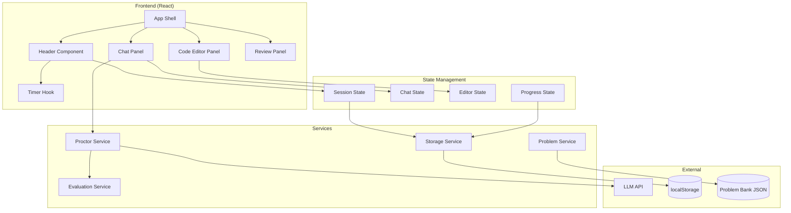
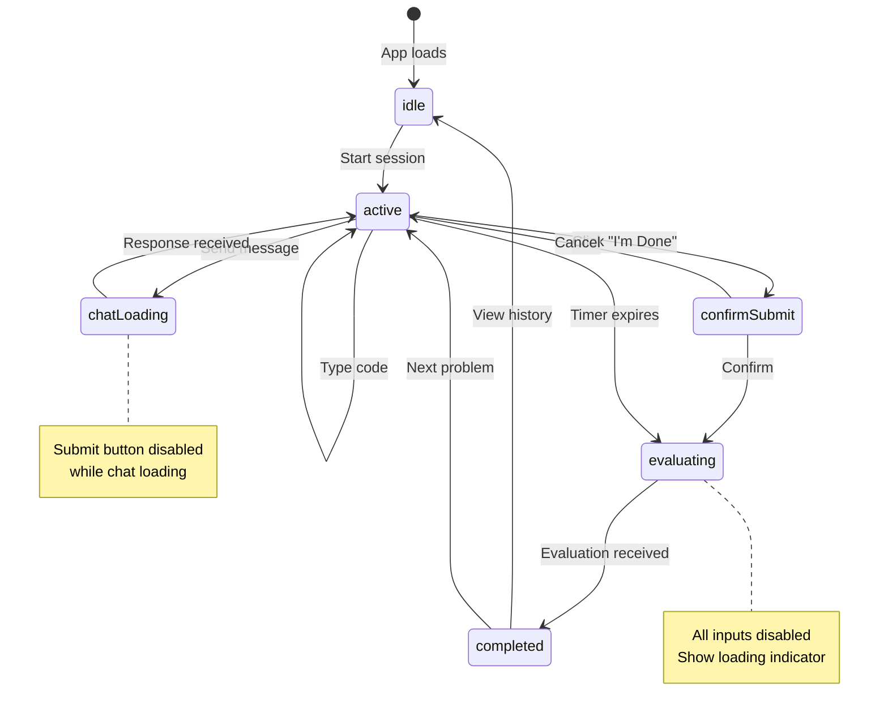
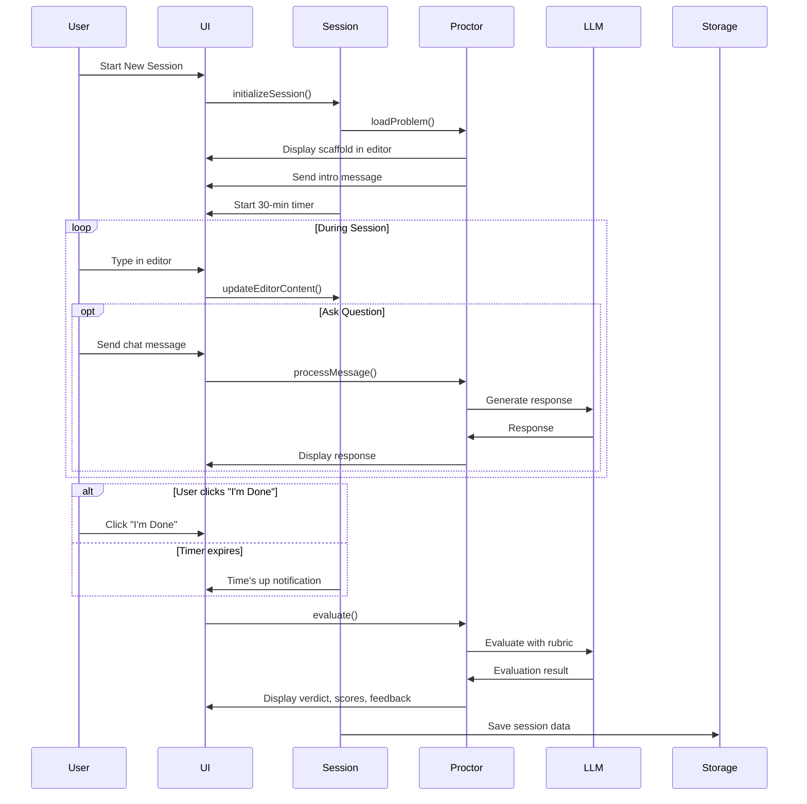

# Design Document: Coding Interview Simulator

## Overview

The Coding Interview Simulator is a web-based application that provides realistic coding interview practice. Users interact with an AI proctor in a timed session, write solutions in a plain text editor, and receive rubric-based evaluation with coaching feedback.

The application follows a client-side architecture with React for the UI and an LLM API for proctor intelligence. Session data persists to localStorage for progress tracking.

### API Key Security Model

**MVP Approach: Bring Your Own Key (BYOK)**

This application uses a client-side only architecture. Since API keys cannot be securely stored in a browser-bundled SPA, users must provide their own LLM API key.

- User enters their API key in a Settings modal on first launch
- Key is stored in localStorage (encrypted with a user-provided passphrase, optional)
- Key is sent directly from browser to LLM API (no backend proxy)
- User is responsible for their own API usage and billing

**Security Implications (be explicit with users):**
- The API key is visible in browser DevTools Network tab
- Users should use keys with spending limits set
- On shared devices, other users could access stored keys
- Browser sync may copy localStorage to other devices
- XSS vulnerabilities could expose the key
- This is appropriate for a personal practice tool on a trusted device, not a multi-tenant SaaS

**Passphrase Encryption (optional):**
- If user provides passphrase: derive key using PBKDF2 (100k iterations, random salt)
- Store salt alongside encrypted key in localStorage
- Without passphrase: key stored in plaintext (user's choice, with warning)

**Future Enhancement:** Add a backend proxy (Next.js API Routes, Cloudflare Worker) to hide the API key for hosted deployments.

## Architecture



### Session Flow





## Components and Interfaces

### React Components

```typescript
// App.tsx - Main application shell
interface AppProps {}

// Header.tsx - Problem title and timer display
interface HeaderProps {
  problemTitle: string;
  timeRemaining: number; // seconds
  isSessionActive: boolean;
}

// CodeEditorPanel.tsx - Left panel with editor
interface CodeEditorPanelProps {
  problemPrompt: string;
  code: string;
  onCodeChange: (code: string) => void;
  onSubmit: () => void;
  isDisabled: boolean;
}

// ChatPanel.tsx - Right panel with proctor chat
interface ChatPanelProps {
  messages: ChatMessage[];
  onSendMessage: (message: string) => void;
  isDisabled: boolean;
}

// ReviewPanel.tsx - Evaluation results display
interface ReviewPanelProps {
  evaluation: EvaluationResult | null;
  onNextProblem: () => void;
  onViewHistory: () => void;
}

// HistoryPanel.tsx - Past session review
interface HistoryPanelProps {
  sessions: SessionRecord[];
  onSelectSession: (sessionId: string) => void;
  onClose: () => void;
}
```

### Service Interfaces

```typescript
// ProctorService - Handles AI proctor interactions
interface ProctorService {
  generateIntro(problem: Problem): Promise<string>;
  respondToQuestion(
    question: string,
    context: SessionContext
  ): Promise<string>;
  evaluate(
    code: string,
    problem: Problem,
    chatHistory: ChatMessage[]
  ): Promise<EvaluationResult>;
}

// ProblemService - Manages problem bank
interface ProblemService {
  loadProblems(): Promise<Problem[]>;
  getRandomProblem(excludeIds?: string[]): Problem;
  getProblemById(id: string): Problem | null;
}

// StorageService - Handles localStorage persistence with quota management
interface StorageService {
  saveSession(session: SessionRecord): void;
  getSessions(): SessionRecord[];
  getSession(id: string): SessionRecord | null;
  clearSessions(): void;
  getStorageUsage(): { used: number; limit: number; percentage: number };
  pruneOldSessions(keepCount: number): void;
}

// EvaluationService - Validation and fallback logic
// NOTE: The LLM verdict is authoritative. This service validates JSON shape
// and provides fallback verdict only if LLM response is malformed.
interface EvaluationService {
  parseEvaluationResponse(llmResponse: string): EvaluationResult;
  validateEvaluationResult(result: EvaluationResult): boolean;
  calculateFallbackVerdict(scores: RubricScores): Verdict;
  extractMissTags(evaluation: EvaluationResult): string[];
}
```

### Custom Hooks

```typescript
// useTimer - Countdown timer management
interface UseTimerReturn {
  timeRemaining: number;
  isRunning: boolean;
  start: (durationSeconds: number) => void;
  pause: () => void;
  reset: () => void;
}

// useSession - Session state management
interface UseSessionReturn {
  session: Session | null;
  startSession: (problem: Problem) => void;
  endSession: () => void;
  updateCode: (code: string) => void;
  submitForEvaluation: () => Promise<void>;
}

// useChat - Chat state management
interface UseChatReturn {
  messages: ChatMessage[];
  sendMessage: (content: string) => Promise<void>;
  isLoading: boolean;
  clearMessages: () => void;
}
```

## Data Models

```typescript
// Problem from the problem bank
interface Problem {
  id: string;
  language: 'javascript' | 'python' | 'typescript';
  title: string;
  difficulty: 'easy' | 'medium' | 'hard';
  timeLimit: number; // minutes
  prompt: string;
  constraints: string[]; // e.g., ["1 <= n <= 10000", "Input is always valid"]
  scaffold: string;
  examples: Example[];
  expectedApproach: string;
  commonPitfalls: string[];
  idealSolutionOutline: string;
  evaluationNotes: string;
}

interface Example {
  input: string;
  output: string;
  explanation?: string;
}

// Chat message in the conversation
interface ChatMessage {
  id: string;
  role: 'user' | 'proctor';
  content: string;
  timestamp: number;
}

// Active session state
interface Session {
  id: string;
  problemId: string;
  startTime: number;
  endTime: number | null;
  status: 'active' | 'evaluating' | 'completed';
  code: string;
  chatHistory: ChatMessage[];
}

// Session context for proctor responses
interface SessionContext {
  problem: Problem;
  currentCode: string;
  chatHistory: ChatMessage[];
  timeRemaining: number;
}

// Rubric scores (0-4 each)
interface RubricScores {
  approach: number;
  completeness: number;
  complexity: number;
  communication: number;
}

// Verdict types
type Verdict = 'Pass' | 'Borderline' | 'No Pass';

// Complete evaluation result
interface EvaluationResult {
  verdict: Verdict;
  scores: RubricScores;
  feedback: {
    strengths: string[];
    improvements: string[];
  };
  idealSolution: string;
  missTags: string[];
}

// Persisted session record (optimized for storage)
// NOTE: System prompts are NOT stored per-session to save space
// Chat transcript stores only user messages and proctor responses, not full LLM context
interface SessionRecord {
  id: string;
  problemId: string;
  problemTitle: string;
  timestamp: number;
  duration: number; // seconds
  finalCode: string;
  chatTranscript: ChatMessage[]; // user + proctor messages only, no system prompts
  evaluation: EvaluationResult;
}

// Application state
interface AppState {
  view: 'home' | 'session' | 'review' | 'history';
  currentSession: Session | null;
  currentProblem: Problem | null;
  evaluation: EvaluationResult | null;
  sessionHistory: SessionRecord[];
}
```

### Problem Bank JSON Schema

```json
{
  "problems": [
    {
      "id": "fizzbuzz",
      "language": "javascript",
      "title": "FizzBuzz",
      "difficulty": "easy",
      "timeLimit": 5,
      "prompt": "Write a function that prints numbers 1 to n...",
      "constraints": ["1 <= n <= 10000", "n is always a positive integer"],
      "scaffold": "function fizzBuzz(n) {\n  // Your code here\n}",
      "examples": [
        { "input": "15", "output": "1, 2, Fizz, 4, Buzz..." }
      ],
      "expectedApproach": "Loop with modulo checks",
      "commonPitfalls": ["Order of checks matters", "Off-by-one"],
      "idealSolutionOutline": "for loop, check %15 first, then %3, then %5",
      "evaluationNotes": "Look for understanding of modulo operator"
    }
  ]
}
```


## Correctness Properties

*A property is a characteristic or behavior that should hold true across all valid executions of a system—essentially, a formal statement about what the system should do. Properties serve as the bridge between human-readable specifications and machine-verifiable correctness guarantees.*

### Property 1: Timer Initialization

*For any* session start with a problem that has a defined time limit, the timer SHALL be initialized to that time limit (in seconds) and begin counting down.

**Validates: Requirements 1.1, 1.2**

### Property 2: Timer Expiry Triggers Evaluation

*For any* active session where the timer reaches zero, the session status SHALL transition to 'evaluating' and the evaluation process SHALL be triggered.

**Validates: Requirements 1.3**

### Property 3: Submit Triggers Evaluation

*For any* active session, when the submit action is invoked, the session status SHALL transition from 'active' to 'evaluating'.

**Validates: Requirements 1.4**

### Property 4: Scaffold Populates Editor

*For any* problem with a scaffold, when a session starts with that problem, the editor content SHALL equal the problem's scaffold string.

**Validates: Requirements 3.1, 7.2**

### Property 5: Evaluation Result Validity

*For any* evaluation result returned by the proctor service:
- All rubric scores (approach, completeness, complexity, communication) SHALL be integers in range [0, 4]
- The verdict SHALL be one of: 'Pass', 'Borderline', 'No Pass'
- The improvements array SHALL contain 2-3 items (enforce in validation, request regeneration if outside range)
- The idealSolution SHALL be a non-empty string in the problem's specified language

**Validates: Requirements 4.2, 4.3, 4.6, 4.7**

### Property 6: Chat Message Persistence

*For any* message sent by the user, after the send operation completes, the chat history SHALL contain that message with role 'user' and the exact content.

**Validates: Requirements 6.2**

### Property 7: Editor Content Preservation

*For any* sequence of code updates during an active session, the editor content SHALL always reflect the most recent update and SHALL NOT be modified by other state changes (chat messages, timer ticks).

**Validates: Requirements 7.4**

### Property 8: Problem Bank Validity

*For any* problem loaded from the problem bank, it SHALL contain all required fields: id, title, prompt, scaffold, examples, expectedApproach, and evaluationNotes.

**Validates: Requirements 8.1, 8.3**

### Property 9: Next Problem Uniqueness

*For any* call to get the next problem with an exclusion list, the returned problem's id SHALL NOT be in the exclusion list (when multiple problems exist).

**Validates: Requirements 8.4**

### Property 10: Session Record Round-Trip

*For any* session record saved to storage, loading that record by id SHALL return an equivalent object containing: problemId, finalCode, chatTranscript, evaluation scores, and missTags.

**Validates: Requirements 9.1, 9.4**

## Error Handling

### LLM API Errors

| Error Scenario | Handling Strategy |
|----------------|-------------------|
| API timeout | Display "Proctor is thinking..." for up to 30s, then show retry option |
| API rate limit | Queue messages, show "Please wait" indicator |
| API unavailable | Show error message, allow user to continue coding, retry evaluation later |
| Malformed response | Log error, request regeneration with simplified prompt |

### Session Errors

| Error Scenario | Handling Strategy |
|----------------|-------------------|
| Browser tab closed | Auto-save session state to localStorage every 30 seconds via `setInterval` in `useEffect` |
| localStorage full | Auto-prune oldest completed sessions (LRU), warn user if still full |
| localStorage quota warning | Show toast when usage exceeds 80%, suggest clearing old sessions |
| Timer desync | Use `performance.now()` for elapsed time + `Date.now()` for wall clock; recalculate on `visibilitychange` event |
| Corrupted session data | Validate JSON on load, skip corrupted records with console warning |

### Auto-Save Implementation

```typescript
// In useSession hook
useEffect(() => {
  if (session?.status !== 'active') return;
  
  const interval = setInterval(() => {
    saveSessionDraft(session);
  }, 30_000); // 30 seconds
  
  return () => clearInterval(interval);
}, [session]);
```

### Data Validation Errors

| Error Scenario | Handling Strategy |
|----------------|-------------------|
| Invalid problem JSON | Skip problem, log error, load next valid problem |
| Missing required fields | Use defaults where safe, warn in console |
| Corrupted session data | Offer to clear corrupted data, start fresh |

### User Input Errors

| Error Scenario | Handling Strategy |
|----------------|-------------------|
| Empty code submission | Allow submission, proctor evaluates as incomplete |
| Very long messages | Truncate at 2000 characters with warning |
| Rapid message spam | Debounce to 1 message per 2 seconds |

### Concurrency Rules

| Scenario | Behavior |
|----------|----------|
| User clicks "I'm Done" while chat loading | Queue evaluation, wait for chat response to complete first |
| Timer expires while chat loading | Abort chat request via `AbortController.abort()`, trigger evaluation immediately |
| User sends message while evaluating | Ignore (input disabled during evaluation) |
| User clicks "Next Problem" while evaluating | Ignore (button disabled during evaluation) |

### Request Cancellation

```typescript
// In ProctorService
class ProctorService {
  private abortController: AbortController | null = null;
  
  async respondToQuestion(question: string, context: SessionContext): Promise<string> {
    this.abortController = new AbortController();
    
    const response = await fetch(LLM_ENDPOINT, {
      signal: this.abortController.signal,
      // ... other options
    });
    
    return response.text();
  }
  
  cancelPendingRequest(): void {
    this.abortController?.abort();
    this.abortController = null;
  }
}
```

## Testing Strategy

### Unit Testing

Unit tests focus on specific examples, edge cases, and component isolation:

- **Timer Hook**: Test start, pause, reset, expiry callback
- **Storage Service**: Test save, load, clear, handle missing data
- **Evaluation Service**: Test score parsing, verdict calculation, miss tag extraction
- **Problem Service**: Test loading, random selection, exclusion filtering

### Property-Based Testing

Property-based tests validate universal properties across generated inputs. Use **fast-check** library for JavaScript/TypeScript.

Configuration:
- Minimum 100 iterations per property test
- Each test tagged with: `Feature: coding-interview-simulator, Property {N}: {description}`

**Property Tests to Implement:**

1. **Timer Initialization** - Generate random time limits, verify timer starts correctly
2. **Timer Expiry** - Simulate timer reaching zero, verify evaluation triggered
3. **Submit State Transition** - Generate random session states, verify submit transitions correctly
4. **Scaffold Population** - Generate problems with scaffolds, verify editor content
5. **Evaluation Result Validity** - Generate evaluation responses, verify structure constraints
6. **Chat Message Persistence** - Generate random messages, verify they appear in history
7. **Editor Content Preservation** - Generate update sequences, verify content integrity
8. **Problem Bank Validity** - Generate/load problems, verify required fields
9. **Next Problem Uniqueness** - Generate exclusion lists, verify returned problem not excluded
10. **Session Record Round-Trip** - Generate session records, verify save/load equivalence

### Integration Testing

- **Session Flow**: Start session → type code → send messages → submit → verify evaluation displayed
- **Problem Cycling**: Complete problem → next problem → verify different problem loaded
- **Persistence**: Complete session → refresh page → verify history contains session

### Test File Structure

```
src/
├── hooks/
│   └── __tests__/
│       ├── useTimer.test.ts
│       └── useTimer.property.test.ts
├── services/
│   └── __tests__/
│       ├── storageService.test.ts
│       ├── storageService.property.test.ts
│       ├── evaluationService.test.ts
│       ├── evaluationService.property.test.ts
│       ├── problemService.test.ts
│       └── problemService.property.test.ts
└── components/
    └── __tests__/
        ├── ChatPanel.test.tsx
        └── CodeEditorPanel.test.tsx
```


## LLM Prompts

### Live Chat Prompt (Turn-by-Turn)

Used for every user message during the session.

**System Prompt:**
```
You are the Proctor in a timed Python coding assessment simulator.
Your job:
- Behave like a friendly, supportive interviewer.
- Help the candidate succeed without giving away the full solution.
- Focus on intent and logic, not syntax.
- Accept pseudocode as valid.
- Never be pedantic about tiny syntax issues.

Rules:
1) Do NOT write the complete solution code unless the candidate explicitly clicks "I'm done" (evaluation phase).
2) If the candidate is stuck, give a hint ladder:
   - (a) high-level approach
   - (b) key insight or data structure
   - (c) edge cases to consider
   - (d) small pseudocode snippet (not full solution)
3) Ask at most ONE clarifying question at a time, and only when needed.
4) Keep responses short and practical (aim for 4–10 sentences).
5) If the candidate's current direction is wrong, gently redirect with a hint rather than saying "wrong".
6) If time remaining is under 5 minutes, add one sentence of time management guidance.

Tone:
- calm, encouraging, human interviewer vibe
- not overly formal
- not overly enthusiastic
```

**User Template:**
```
PROBLEM: {problemTitle}
{problemPrompt}

CONSTRAINTS / NOTES:
{problemConstraintsOrNotes}

CANDIDATE'S CURRENT EDITOR TEXT:
{currentCodeOrPseudocode}

CHAT HISTORY (most recent last):
{chatHistory}

TIME REMAINING (seconds): {timeRemaining}

CANDIDATE MESSAGE:
{candidateMessage}

Respond as the Proctor.
```

### Evaluation Prompt (Rubric + Coaching)

Called once when user clicks "I'm Done" or timer expires.

**System Prompt:**
```
You are the Proctor evaluating a candidate's solution in a Python coding assessment simulator.

You MUST:
- Evaluate intent and logic, not syntax.
- Accept pseudocode as valid if the algorithm is clear.
- Infer missing minor syntax if needed, but DO NOT invent missing logic.
- Be fair and consistent using the rubric.
- Provide 2–3 high-impact improvements (no exhaustive nitpicks).
- First say what is correct, then what is missing.
- If the approach is incorrect, guide with hints and what to change; do not shame.
- After feedback, provide ONE ideal answer (clean code in the SAME LANGUAGE as the problem) that demonstrates the improved solution.

Rubric scoring (0–4 each):
- approach: correctness of the chosen algorithm / strategy
- completeness: covers requirements and typical edge cases
- complexity: identifies reasonable time/space complexity and tradeoffs
- communication: clarity and structure of explanation / pseudocode / code

Verdict rules:
- Pass: total >= 13 AND no category below 3
- Borderline: total 9–12 OR any category == 2 with otherwise strong work
- No Pass: total <= 8 OR approach score is 0 or 1 (fundamental approach failure is auto-fail)

Miss tags: Return 1–4 tags from this list (only if applicable):
- edge-cases
- complexity-analysis
- incorrect-approach
- incomplete-solution
- unclear-communication
- wrong-data-structure
- off-by-one
- constraints-missed
- testing-mentality

Output MUST be valid JSON and nothing else.
```

**User Template:**
```
PROBLEM: {problemTitle}
{problemPrompt}

CONSTRAINTS / NOTES:
{problemConstraintsOrNotes}

PROBLEM METADATA (for consistent evaluation):
Expected approach: {expectedApproach}
Common pitfalls: {commonPitfalls}
Ideal solution outline: {idealSolutionOutline}

CANDIDATE'S FINAL EDITOR TEXT:
{finalCodeOrPseudocode}

CHAT TRANSCRIPT:
{chatHistory}

TIME SPENT (seconds): {durationSeconds}

Now evaluate.
```

**Required JSON Output:**
```json
{
  "verdict": "Pass | Borderline | No Pass",
  "scores": {
    "approach": 0,
    "completeness": 0,
    "complexity": 0,
    "communication": 0
  },
  "feedback": {
    "strengths": ["..."],
    "improvements": ["..."]
  },
  "idealSolution": "string (clean python solution + brief explanation comments ok)",
  "missTags": ["edge-cases"]
}
```

### Implementation Notes

- Truncate chat history to last 12 turns for efficiency
- Fallback miss tag derivation from scores:
  - `completeness ≤ 2` → `edge-cases` or `incomplete-solution`
  - `complexity ≤ 2` → `complexity-analysis`
  - `communication ≤ 2` → `unclear-communication`
  - `approach ≤ 2` → `incorrect-approach`

### Token Management

To prevent context window overflow and control costs:

**Token Estimation:**
- Use ~4 characters per token heuristic (conservative for code)
- Track: problem_tokens + code_tokens + chat_tokens + system_prompt_tokens

**Context Limits:**
- Live chat prompt: 6,000 tokens max
- Evaluation prompt: 8,000 tokens max

**Truncation Strategy (when over limit):**
1. Chat history: Keep first message (intro) + last N messages, drop middle
2. Code: If > 200 lines, keep last 200 lines (most recent work)
3. Problem metadata: Never truncate (essential for evaluation)

```typescript
interface TokenBudget {
  systemPrompt: number;  // ~500 tokens (fixed)
  problemMetadata: number;  // ~300 tokens (varies by problem)
  code: number;  // variable, cap at 2000 tokens
  chat: number;  // variable, cap at 3000 tokens
  response: number;  // reserve 1000 tokens for response
}
```

## Reference Implementation: Evaluation Parser

The following reference implementation enforces Property 5 (Evaluation Result Validity) and provides retry-once logic for malformed LLM responses.

### parseAndValidateEvaluation.ts

```typescript
export type Verdict = "Pass" | "Borderline" | "No Pass";

export type MissTag =
  | "edge-cases"
  | "complexity-analysis"
  | "incorrect-approach"
  | "incomplete-solution"
  | "unclear-communication"
  | "wrong-data-structure"
  | "off-by-one"
  | "constraints-missed"
  | "testing-mentality";

export interface RubricScores {
  approach: number; // 0-4
  completeness: number; // 0-4
  complexity: number; // 0-4
  communication: number; // 0-4
}

export interface EvaluationResult {
  verdict: Verdict;
  scores: RubricScores;
  feedback: {
    strengths: string[];
    improvements: string[];
  };
  idealSolution: string;
  missTags: MissTag[];
}

const VERDICTS: Verdict[] = ["Pass", "Borderline", "No Pass"];

const MISS_TAGS: readonly MissTag[] = [
  "edge-cases",
  "complexity-analysis",
  "incorrect-approach",
  "incomplete-solution",
  "unclear-communication",
  "wrong-data-structure",
  "off-by-one",
  "constraints-missed",
  "testing-mentality",
] as const;

const MISS_TAG_SET = new Set<string>(MISS_TAGS);

export class EvaluationParseError extends Error {
  public readonly raw: string;
  constructor(message: string, raw: string) {
    super(message);
    this.name = "EvaluationParseError";
    this.raw = raw;
  }
}

function clampInt(n: unknown, min: number, max: number, fallback: number): number {
  const x = typeof n === "number" ? n : Number(n);
  if (!Number.isFinite(x)) return fallback;
  const r = Math.round(x);
  return Math.min(max, Math.max(min, r));
}

function asStringArray(v: unknown): string[] {
  if (!Array.isArray(v)) return [];
  return v
    .map((x) => (typeof x === "string" ? x : String(x)))
    .map((s) => s.trim())
    .filter(Boolean);
}

function firstNonEmpty(arr: string[], maxItems: number): string[] {
  return arr.map((s) => s.trim()).filter((s) => s.length > 0).slice(0, maxItems);
}

/**
 * Extract the first JSON object from a string.
 * Supports:
 * - plain JSON
 * - ```json ... ``` fenced output
 * - extra text before/after by slicing from first "{" to last "}"
 */
function extractJsonObject(text: string): string | null {
  const t = text.trim();

  // ```json ... ```
  const fenceMatch = t.match(/```(?:json)?\s*([\s\S]*?)\s*```/i);
  if (fenceMatch?.[1]) {
    const inner = fenceMatch[1].trim();
    return isolateBraces(inner) ?? inner;
  }

  return isolateBraces(t);
}

function isolateBraces(text: string): string | null {
  const start = text.indexOf("{");
  const end = text.lastIndexOf("}");
  if (start === -1 || end === -1 || end <= start) return null;
  return text.slice(start, end + 1);
}

/**
 * Fallback verdict computation - ONLY used when LLM verdict is missing/invalid.
 * 
 * AUTHORITY MODEL:
 * - LLM verdict is authoritative when present and valid
 * - Fallback is ONLY used if verdict field is missing, empty, or not in ["Pass", "Borderline", "No Pass"]
 * - This allows LLM to make nuanced judgments (e.g., "Pass" for creative solutions with lower scores)
 * 
 * Fallback rules (mirror prompt for consistency):
 * - Pass: total >= 13 AND no category < 3
 * - No Pass: total <= 8 OR approach <= 1
 * - Borderline: everything else
 */
function computeFallbackVerdict(scores: RubricScores): Verdict {
  const total =
    scores.approach + scores.completeness + scores.complexity + scores.communication;

  const minCategory = Math.min(
    scores.approach,
    scores.completeness,
    scores.complexity,
    scores.communication
  );

  if (total >= 13 && minCategory >= 3) return "Pass";
  if (total <= 8 || scores.approach <= 1) return "No Pass";
  return "Borderline";
}

/**
 * Parse + validate LLM evaluation JSON into a safe EvaluationResult.
 * - strict JSON parsing (with salvage of fenced/extra text)
 * - score clamp (0–4)
 * - missTags allowlist + 1–4 max + de-dupe
 * - verdict enum validation w/ fallback computation
 * - requires feedback + idealSolution (throws if missing → triggers retry)
 */
export function parseAndValidateEvaluation(llmText: string): EvaluationResult {
  const jsonStr = extractJsonObject(llmText);
  if (!jsonStr) {
    throw new EvaluationParseError("Could not find JSON object in LLM output.", llmText);
  }

  let parsed: any;
  try {
    parsed = JSON.parse(jsonStr);
  } catch {
    throw new EvaluationParseError("Invalid JSON in LLM output.", llmText);
  }

  const rawScores = parsed?.scores ?? {};
  const scores: RubricScores = {
    approach: clampInt(rawScores.approach, 0, 4, 0),
    completeness: clampInt(rawScores.completeness, 0, 4, 0),
    complexity: clampInt(rawScores.complexity, 0, 4, 0),
    communication: clampInt(rawScores.communication, 0, 4, 0),
  };

  const rawVerdict = typeof parsed?.verdict === "string" ? parsed.verdict.trim() : "";
  const verdict: Verdict = (VERDICTS as readonly string[]).includes(rawVerdict)
    ? (rawVerdict as Verdict)
    : computeFallbackVerdict(scores);

  const fb = parsed?.feedback ?? {};
  const strengths = firstNonEmpty(asStringArray(fb.strengths), 8);
  const improvements = firstNonEmpty(asStringArray(fb.improvements), 8);

  const idealSolution =
    typeof parsed?.idealSolution === "string" ? parsed.idealSolution.trim() : "";

  const rawTags = asStringArray(parsed?.missTags);
  const missTags: MissTag[] = Array.from(
    new Set(rawTags.filter((t) => MISS_TAG_SET.has(t)).slice(0, 4))
  ) as MissTag[];

  // Enforce minimum useful payload (so we can retry once)
  if (!idealSolution) {
    throw new EvaluationParseError("Missing idealSolution in evaluation JSON.", llmText);
  }
  if (strengths.length === 0 && improvements.length === 0) {
    throw new EvaluationParseError("Missing feedback strengths/improvements.", llmText);
  }

  return {
    verdict,
    scores,
    feedback: { strengths, improvements },
    idealSolution,
    missTags,
  };
}
```

### getEvaluationWithRetry.ts

```typescript
import { 
  EvaluationResult, 
  parseAndValidateEvaluation, 
  EvaluationParseError 
} from "./parseAndValidateEvaluation";

export async function getEvaluationWithRetry(opts: {
  callLLM: (prompt: string) => Promise<string>;
  prompt: string;
}): Promise<EvaluationResult> {
  const { callLLM, prompt } = opts;

  const first = await callLLM(prompt);
  try {
    return parseAndValidateEvaluation(first);
  } catch (err) {
    // Only retry for parse/shape errors
    if (!(err instanceof EvaluationParseError)) throw err;

    const retryPrompt =
      prompt +
      "\n\nIMPORTANT: Respond with ONLY valid JSON that matches the required schema exactly. No markdown, no code fences, no extra text.";

    const second = await callLLM(retryPrompt);
    return parseAndValidateEvaluation(second);
  }
}
```

### Key Features

- **JSON extraction**: Handles plain JSON, fenced code blocks, and extra text around JSON
- **Score clamping**: Ensures all scores are integers 0-4
- **Verdict fallback**: Computes verdict from scores if LLM omits or provides invalid value
- **MissTag validation**: Allowlist enforcement, deduplication, max 4 tags
- **Retry-once**: Automatically retries with stricter prompt on parse failure
- **Property 5 enforcement**: Throws if missing required fields (idealSolution, feedback)
